# AI Genealogy Validation

This repository contains a Python automation pipeline for validating AI-generated genealogy queries.
It sends natural-language genealogy questions to an AI API, saves the API responses, and evaluates the generated Cypher queries against expected ground truth.

## What this does

- Reads questions from `questions.json`
- Loads an API token from `tokens/access_token.txt`
- Sends each question to the genealogy API endpoint at `https://ai360.dev.mareana.com/v1/ai-360/genealogy/query`
- Extracts fields from the API response such as:
  - `cypher_query`
  - `sql_query`
  - `summary`
  - `classification`
  - `intent`
  - `is_valid`
  - `is_safe`
- Writes API results to `output/genealogy_results.xlsx`
- Writes normalized generated responses to `output/responses.json`
- Compares generated responses against `ground_truth.json`
- Appends evaluation sheets to `output/genealogy_results.xlsx`

## Why this exists

This project validates an AI genealogy workflow by running questions through the API and then evaluating the generated query results against a ground truth dataset.
It helps verify that:

- the API endpoint is reachable and returning responses
- generated Cypher queries match expected ground truth
- structured output is saved for both raw response inspection and evaluation metrics

## Repository structure

- `run.py` - orchestrates the full pipeline: run questions, then evaluate responses
- `run_questions.py` - sends questions to the API and saves result files
- `evaluate_responses.py` - evaluates generated responses against `ground_truth.json`
- `questions.json` - list of question objects sent to the API
- `ground_truth.json` - expected Cypher queries for evaluation
- `tokens/access_token.txt` - API access token used for authorization
- `output/` - target folder for generated results
- `requirements.txt` - Python dependencies
- `Dockerfile` - optional containerized runtime
- `testai.py` - a small local model test script

## How this works

The pipeline now has two stages:

1. `run_questions.py`
   - ensures `output/` exists
   - reads the API token from `tokens/access_token.txt`
   - loads questions from `questions.json`
   - posts each question to the AI genealogy API
   - parses the JSON response
   - writes `output/genealogy_results.xlsx`
   - writes `output/responses.json`

2. `evaluate_responses.py`
   - loads `output/responses.json`
   - loads `ground_truth.json`
   - validates that IDs match between the two files
   - evaluates each generated query against the corresponding ground truth query
   - appends evaluation sheets to `output/genealogy_results.xlsx`
   - writes summary metrics and confusion matrix

## Pipeline diagrams

These diagrams visualize the current pipeline and data flow.

### Full flowchart



### Component breakdown



### Data flow view



## How to use it

### Run the full pipeline locally

```bash
cd /Users/sharan/Desktop/validation_clone/ai_validation
source ../myvenv/bin/activate
pip install -r requirements.txt
python run.py
```

### Run stages individually

```bash
python run_questions.py
python evaluate_responses.py
```

## Output files

- `output/genealogy_results.xlsx` - API results and evaluation sheets
- `output/responses.json` - normalized responses used for evaluation

## Notes and best practices

- Keep `tokens/access_token.txt` private and do not commit it.
- Update `questions.json` to change the question set.
- Update `ground_truth.json` when you add or change expected Cypher queries.
- Use `run.py` for the complete end-to-end workflow.

## Troubleshooting

- `FileNotFoundError` for `tokens/access_token.txt`: make sure the token file exists and has a valid token.
- `FileNotFoundError` for `questions.json` or `ground_truth.json`: ensure these files are present in the repo root.
- `FileNotFoundError` for `output/genealogy_results.xlsx`: run `run_questions.py` first to generate the file before evaluating.
- API failures: verify network access and that the endpoint is reachable.
